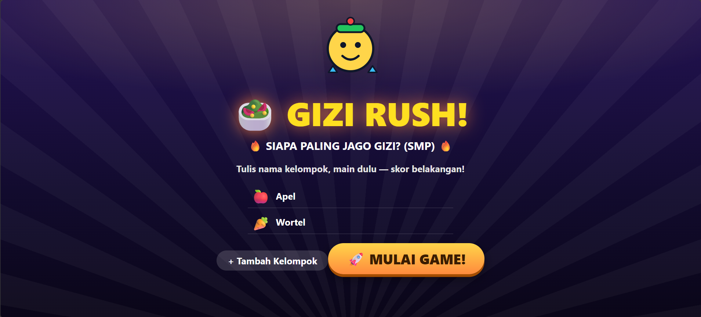

# Gizi Rush

Game show edukasi gizi.



🔗 **Demo:** https://gizi-rush.vercel.app/

> Lokal: jalankan `npm run dev` lalu buka alamat yang tampil di terminal (default Vite `http://localhost:5173`).

Acuan desain: `docs/PRD.md`, `docs/Design.md`, `docs/Architecture.md`.

## Fitur Utama

- Menu 5 sesi berurutan dengan sistem kunci (`🔒`/`⭐`/`✅`), tiap sesi 5 level
- Bank 10 soal per sesi kuis (2 per level), 5 yang tampil dipilih acak 1 per level — tiap buka sesi susunannya bisa berganti; tombol `🔀 Acak soal` di kartu sesi
- 5 sesi: Mitos/Fakta (+100), Susun Piring drag-and-drop (0–250), Food Battle (+150), Guru vs Siswa (+200), Final Rush (+500)
- Susun Piring: 27 makanan (pool 6–8 per misi berisi jebakan), 5 misi 4 Sehat 5 Sempurna + total nilai gizi live (kkal, protein, karbo, lemak, serat, gula) vs target misi; angka gizi acuan TKPI/USDA, wajib review ahli gizi
- Skor multi-tim sekali klik: tap chips tim yang benar, 1 klik award, ada `↩ Undo` anti salah tap
- Countdown 3-2-1-GO setiap buka sesi, confetti juara, sound effect synth lokal + mute
- Kontrol keyboard penuh untuk fasilitator (lihat [Kontrol](#-kontrol-fasilitator))
- Leaderboard, progress tersimpan di `localStorage` (refresh tidak menghilangkan sesi)
- 100% offline: tanpa backend, tanpa fetch/CDN, seluruh aset lokal

## 🧰 Tech Stack

| Komponen | Teknologi |
|---|---|
| Bahasa | TypeScript |
| UI | React 19 |
| Build tool | Vite 8 |
| Styling | Tailwind CSS 4 |
| Linter | Oxlint |
| Data | JSON lokal (`src/data/`) |
| Penyimpanan | `localStorage` (tanpa backend) |

## ✅ Prasyarat

- Node.js >= 20 (disarankan versi LTS terbaru; teruji di Node.js v22)
- npm >= 10 (atau pnpm/yarn yang kompatibel)
- Browser modern (Chrome/Edge/Firefox terbaru)
- Untuk sesi kelas: 1 laptop + proyektor/layar besar

## 🚀 Instalasi & Menjalankan Lokal

```sh
git clone <url-repo-anda>
cd Gizi-Game

npm install

npm run dev
```

Buka alamat lokal yang tampil di terminal (default `http://localhost:5173`).

Konfigurasi `.env`: **tidak diperlukan** — proyek ini tanpa backend, tanpa API key, tanpa environment variable.

## 📜 Daftar Skrip

| Perintah | Fungsi |
|---|---|
| `npm run dev` | Menjalankan dev server Vite (hot reload) |
| `npm run build` | Typecheck (`tsc -b`) + build static ke `dist/` |
| `npm run preview` | Menjalankan pratinjau hasil `build` secara lokal |
| `npm run lint` | Menjalankan Oxlint |
| `node --experimental-strip-types src/features/game/scoring.check.ts` | Mengecek kebenaran rubrik skor piring |

## 🗂️ Struktur Folder

```text
Gizi-Game/
├── public/
│   ├── favicon.svg
│   └── images/
│       ├── maskot-gizi.svg
│       └── food/*.svg            # pack gambar makanan (lokal, offline)
├── src/
│   ├── components/               # Quiz, TeamPicker, SessionMenu, Leaderboard, Countdown, Confetti
│   ├── rounds/SusunPiring/       # SusunPiring.tsx, Plate.tsx, DraggableFood.tsx
│   ├── features/game/            # useGame.ts, sessions.ts, quizPool.ts, scoring.ts, scoring.check.ts
│   ├── data/                     # 4× kuis 10 soal, susun-piring.json (27 makanan + 5 misi + target gizi)
│   ├── utils/                    # sound.ts (synth WebAudio), useAwardKeys.ts
│   ├── types/game.ts
│   ├── App.tsx                   # setup → menu sesi → main → result
│   ├── main.tsx
│   └── index.css                 # tema game-show + keyframes animasi
├── docs/                         # PRD.md, Design.md, Architecture.md
├── package.json
└── README.md
```

## 🎮 Alur Main

```text
Setup (nama kelompok 2–6, bebas tambah/hapus)
  → Menu Sesi (5 kartu berurutan 🔒/⭐/✅)
  → klik sesi → Countdown 3-2-1-GO (Esc batal) → Main Level 1–5
  → Space = kembali Menu → semua sesi ⭐⭐⭐⭐⭐ → Result + confetti
```

Selesai per level = sudah reveal (agar momen edukasi tersampaikan). Bintang misi piring naik otomatis saat piring `✅` pertama; tombol skor tetap bisa dipakai untuk nilai parsial. Piring auto-kosong tiap ganti misi (skor tim aman).

## ⌨️ Kontrol Fasilitator

| Tombol | Fungsi |
|---|---|
| `→` / `←` | Misi/soal berikut / sebelumnya |
| `R` | Toggle reveal ↔ sembunyikan jawaban |
| `Tab` | Toggle leaderboard |
| `Space` | Kembali ke menu sesi |
| `S` | Kasih skor ke tim terpilih (di layar Quiz/Piring) |
| `1–6` | Toggle chips tim (di layar Quiz/Piring) |
| `M` | Mute |
| `Esc` | Tutup board / batalkan countdown sesi |

## 🧮 Rubrik Susun Piring (maks 250)

Skor = kecocokan total gizi piring vs target misi, live saat drop, maks 6 item anti-spam:

```text
Kelengkapan 100 + Kalori 50 + Protein 30 + Serat 20 + Gula 30 + Lemak 20
```

Makanan `junk` menghukum otomatis lewat gula/lemak/kalori yang jebol + flag `⚠️`. Tiap misi punya target sendiri (L1–L4 empat sehat, L5 4 Sehat 5 Sempurna + susu).

## 🔒 Keamanan

- Tanpa backend, tanpa akun, tanpa data pribadi — tidak ada PII di `src/data/`.
- Tanpa `fetch`/WebSocket/CDN; seluruh aset lokal.
- Input nama kelompok dibatasi 24 karakter, dirender sebagai JSX text (auto-escape, anti-XSS).
- `dist/`, `node_modules/`, `.env*` ter-cover `.gitignore` — jangan commit ketiganya.

## 👥 Informasi Tambahan

- Dikembangkan sebagai media edukasi gizi.
- Dokumen perancangan lengkap: `docs/PRD.md` (kebutuhan produk), `docs/Design.md` (UI/UX), `docs/Architecture.md` (arsitektur). 
